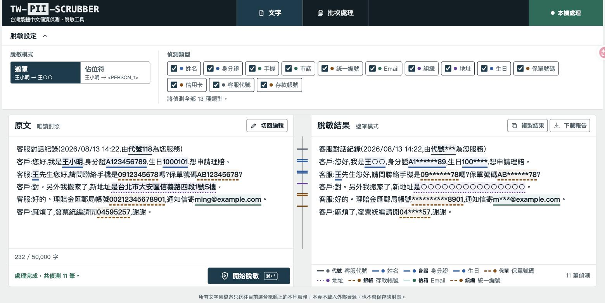
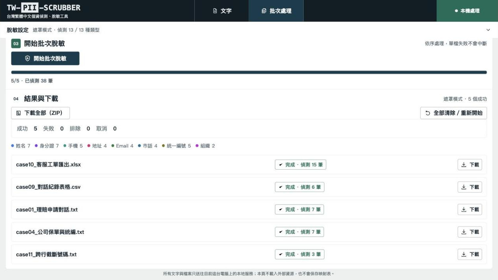

# TW-PII-Scrubber 台灣個資脫敏工具

完全本地離線的台灣個資脫敏工具,針對繁體中文文本(客服對話、名單、
逐字稿)偵測並脫敏 13 種個資:**中文姓名、台灣身分證/新式居留證、
手機、市話、統一編號、Email、組織、地址、生日、保單號碼、信用卡、
客服代號、存款帳號**。

> **TW-PII-Scrubber** is a fully offline PII de-identification tool for
> Traditional Chinese (Taiwan) text — detects and masks 13 types of
> Taiwanese PII (national ID, names via CKIP NER, phone numbers, addresses,
> credit cards with Luhn check, etc.) with a local FastAPI + single-file
> web GUI. **No data ever leaves your machine.** Licensed under GPL-3.0.

> ### ⚠️ 這是「遮罩/假名化」,不是不可逆的匿名化
>
> 本工具做的是 **PII 偵測 + 遮罩(masking)/ 假名化(pseudonymization)**:
> 目的是在資料進入 AI、分析、測試或分享流程前**降低直接識別風險**。
>
> 遮罩後的內容**仍保留部分資訊**(`王小明→王○○`、`A123456789→A1******89`),
> 佔位符模式更可下載還原用的映射表。因此:
>
> - **輸出結果仍可能構成個人資料**,尤其在可與其他資料勾稽的情況下;
> - 使用本工具**不免除**《個人資料保護法》或貴組織資料治理規範下的義務;
> - 對外提供或長期保存前,請依貴組織規範評估,必要時加上人工複核。
>
> 本工具**不宣稱**達成法律或統計意義上的「匿名化 / 去識別化完成」。

- 核心引擎:Microsoft Presidio(analyzer + anonymizer)
- 繁中 NER:CKIP Transformers(`ckiplab/bert-base-chinese-ner`)
- 介面:瀏覽器 GUI(單檔 HTML)+ 本地 FastAPI 後端
- **鐵律:任何資料不得離開本機。執行期不呼叫任何外部 API、無 CDN、無遙測。**
  (連 FastAPI 內建 /docs 都停用了——swagger-ui 走 CDN。)





---

## 取得方式:兩種版本擇一

| | **安裝版**(下方步驟) | **綠色版(免安裝可攜包,Windows)** |
|---|---|---|
| 適合對象 | 有 Python 環境、可連網的使用者與開發者 | 受管控電腦:無管理權限、不能裝 Python、不能連外下載 |
| 使用方式 | 照下方指令安裝 | 解壓 → 雙擊「啟動.bat」→ 用 |
| 取得 | 本 repo | 由維護者觸發 GitHub Actions 的 `build-portable` workflow,下載產出的 zip(內含 Python、全部相依與模型,約 1-2GB) |
| 邊界 | — | 若組織以 AppLocker/App Control 封鎖非白名單程式(含 exe/bat/**dll**),綠色版一樣會被擋,需 IT 白名單或改由 IT 派送;下載檔首次執行可能有 SmartScreen 提示;防毒首掃可能拖慢首次啟動;僅支援 64 位元 Windows |

綠色版每一包都在 CI 的真實 Windows 環境建置並對「最終 zip 解壓後的
成品」通過煙霧測試(啟動、實際脫敏、檔案流程);包內附
`PORTABLE_NOTICE.md`(GPL 散布聲明)與完整對應原始碼。

## 安裝與啟動(安裝版)

需求:Python 3.11+。

```bash
# 1. 建立虛擬環境(擇一:venv 或 conda)
python3 -m venv .venv && source .venv/bin/activate

# 2. 安裝相依
pip install -r requirements.txt
# 需要可重現的環境時(建議正式部署使用),改用鎖定版本 + 雜湊驗證:
# pip install --require-hashes -r requirements.lock

# 3. 下載 CKIP 模型到 ./models/(僅此步需要網路,約 400MB)
python scripts/download_models.py

# 4. 一鍵啟動(自動開瀏覽器)
./run.sh          # macOS / Linux
```

Windows(PowerShell;啟動腳本未在真實 Windows 環境實測,問題請開 issue):

```powershell
py -3 -m venv .venv
.\.venv\Scripts\Activate.ps1
pip install -r requirements.txt
python scripts\download_models.py
.\run.bat
```

開啟 `http://127.0.0.1:7860`(伺服器只綁 127.0.0.1,外部無法連入)。
啟動時載入模型約需數十秒,載入後常駐記憶體。

### 離線部署(無外網的內網環境)

在**有網路**的機器上:

```bash
pip download -r requirements.txt -d wheels/     # 打包所有 wheel
python scripts/download_models.py               # 模型到 ./models/
```

把整個專案目錄(含 `wheels/` 與 `models/`)複製到離線機器:

```bash
pip install --no-index --find-links wheels/ -r requirements.txt
./run.sh
```

程式一律從 `./models/` 本地路徑載入模型,執行期不會嘗試連網;
找不到本地模型會直接啟動失敗並提示執行下載腳本(fail fast)。

---

## 使用

### 文字脫敏
貼上文字 → 選模式與偵測類型 → 開始脫敏 → 左右對照(片段依類型分色高亮)
→ 複製結果 / 下載稽核報告。

### 兩種模式
| 模式 | 行為 | 範例 |
|------|------|------|
| 遮罩(mask) | 部分遮蔽,保留格式線索 | 王小明→王○○、A123456789→A1******89 |
| 佔位符(placeholder) | 換成 `<類型_編號>`,同值同編號 | 王小明→`<PERSON_1>` |

佔位符模式可另外下載「映射表」(佔位符↔原值)。映射表**只存在記憶體與
回應中,絕不寫入磁碟**;下載前有警告提示,請妥善保管。

### 批次處理(.txt / .csv / .xlsx,1–20 檔)
拖放或選取多個檔案 → 同名欄位一次設定策略(整欄遮罩 / NER 偵測 / 略過,
可逐檔展開覆寫)→ 開始批次(逐檔進度、**單檔失敗不中斷整批**)→
逐檔下載,或「下載全部(ZIP)」(內含所有脫敏檔+批次報告.json)。
檔案全程在記憶體處理(含 ZIP 打包),**不寫任何暫存檔**;
映射表絕不進 ZIP 與報告,僅能逐檔以警告確認後下載。
注意:各檔案的佔位符編號與映射表各自獨立(跨檔同名不共用編號);
ZIP 打包的解碼後總量上限為 60MB。**輸出檔名與報告中的來源檔名會先
經過脫敏**(檔名本身可能含個資;NER 對孤立詞較弱,屬盡力而為)。

### 稽核報告
JSON 格式:時間戳、模式、entity 統計、findings 明細。報告中的原值欄位
一律是**已遮罩版本**(`original_masked`),報告本身不會成為個資外洩源。

### 白名單
編輯專案根目錄 `whitelist.txt`,一行一詞(公司名、產品名),`#` 開頭為註解。
比對採**包含式**:偵測片段完整落在白名單詞的出現範圍內即不脫敏
(例:白名單「某某人壽」也會放行只被標到的「某某」片段)。免重啟,每次請求即時生效。

---

## 各 recognizer 規則說明(合規稽核用)

| Entity | 規則 | 信心分數 |
|--------|------|----------|
| `TW_NATIONAL_ID` | Regex `[A-Z][1289]\d{8}`(含新式居留證第二碼 8/9)+ 檢查碼驗證:字母→兩位數官方對照表(A=10…I=34、O=35、W=32、X=30、Y=31、Z=33),權重 `[1,9,8,7,6,5,4,3,2,1,1]`,總和 mod 10 = 0。規則來源:enylin/taiwan-id-validator,對照表已逐字比對上游原始碼 | 檢查碼合格 0.95;不合 0.1(不脫敏) |
| `TW_MOBILE` | `09\d{8}`,前後不得緊貼英數字;另支援連字號變體 `0912-345-678`、`0912-345678`(明確列舉) | 0.85 |
| `TW_PHONE` | 區碼 `0[2-8]`(含 3-4 碼區碼)+ 分隔符(`-`/空白/括號)+ 6-8 碼 | 有分隔符 0.75;無分隔符裸號碼 0.45(預設不遮,見下) |
| `TW_UBN` | 8 碼 + 財政部新制檢查碼(權重 `[1,2,1,2,1,2,4,1]`、乘積十位+個位相加、mod 5 = 0;第 7 位為 7 時 (和+1) mod 5 = 0 亦合格)。規則來源:taiwan-id-validator | 上下文含「統編/統一編號/買受人/賣方/營利事業」0.95;裸 8 碼 0.45(預設不遮);檢查碼不合 0.1 |
| `EMAIL_ADDRESS` | 自訂實作,明確 lookaround 判界;不採用 Presidio 內建版(其 `\b` 字邊界在 email 緊貼中文字時會失效) | 1.0 |
| `PERSON`/`ORG`/`LOC` | CKIP Transformers NER(GPE 併入 LOC),按「,。:;!?」切句推論;長文分段時左右各帶 30 字重疊,避免姓名被切點截斷 | 0.85 |
| `LOC`(完整地址) | 結構規則:`[縣市]?[鄉鎮市區]?路名(路/街/大道)[段]?[巷]?[弄]?號[樓]?`,「號」為必要錨點,補 CKIP 只標行政區的缺口 | 0.9 |
| `BIRTHDAY` | 民國生日 6-7 碼(年 01-99/100-129+月 01-12+日 01-31,月日合法性驗證) | 上下文含「生日/出生」0.95;裸數字 0.45(不遮,6-7 碼撞訂單/金額) |
| `TW_POLICY_NO` | 保單號碼 10 碼:純數字或 2-5 碼大寫英文+餘數字 | 上下文含「保單/契約」0.95;裸英文開頭 0.7;裸純數字 0.45(不遮,撞電話/金額) |
| `CREDIT_CARD` | 16 碼連續數字 + Luhn 檢查碼;含 `4-4-4-4` 連字號與空格分組 | Luhn 合格 0.95;不合 0.1(不遮) |
| `AGENT_CODE` | 字面「代號」(可帶冒號)+2-3 碼數字 | 0.9 |
| `TW_BANK_ACCOUNT` | 銀行 13 碼/郵局 14 碼連續數字 | 上下文含「帳號/匯款/郵局」0.95;裸值 0.75(遮,長串在客服語境幾乎必是帳號) |

**引擎門檻:score < 0.5 一律不脫敏、不出現在 findings。**

### 遮罩格式定義
| Entity | 遮罩規則 | 範例 |
|--------|----------|------|
| 姓名/組織/地址 | 保留首字,其餘「○」 | 王小明→王○○;複姓同規則(歐陽台生→歐○○○) |
| 身分證 | 首尾各 2 碼保留 | A123456789→A1******89 |
| 手機 | 中間 4 碼 `*` | 0912345678→091****678 |
| 市話 | 保留前 2 碼(區碼)與末 2 碼數字,分隔符不動 | 02-27208889→02-******89 |
| 統編 | 首尾各 2 碼保留 | 04595257→04****57 |
| Email | 帳號留首字元,網域保留 | test@example.com→t***@example.com |
| 生日 | 保留民國年,遮月日 | 1000101→100**** |
| 保單號碼 | 首尾各 2 碼保留 | AB12345678→AB******78 |
| 信用卡/存款帳號 | 僅保留末 4 碼(業界慣例),分隔符保留 | 4111111111111111→************1111 |
| 客服代號 | 「代號」保留,數字全遮 | 代號11→代號** |

### 設計決策(原則:寧可多遮,絕不外洩)
1. **Presidio 中文支援**:Presidio 官方不支援 zh,本工具以 `spacy.blank("zh")`
   建立空白 pipeline 掛入(零額外下載、完全離線);NER 全由 CKIP 負責。
2. **統編/市話的信心分層**:統編新制檢查碼為 mod 5,隨機 8 碼數字有 1/5
   機率通過——若裸 8 碼一律遮罩,發票金額、訂單編號會大量誤遮。故裸數字
   給 0.45(低於門檻),有統編上下文關鍵詞才 0.95。無分隔符市話同理。
   **需要更嚴格的遮罩時,請用「檔案模式的整欄遮罩」處理確定含個資的欄位。**
3. **逾時處理**:CKIP 推論採「分段 + 段間檢查累計耗時」的合作式逾時
   (60 秒),超時整個請求失敗,**不會回傳部分脫敏的文字**(fail-closed)。
4. **座標防線**:CKIP 回傳座標逐 token 驗證與原文一致,對不上先小範圍
   重對齊、再失敗即整個請求報錯,絕不輸出座標錯置的脫敏結果。
5. **檔案處理不落地**:上傳檔案全程只存在記憶體(含 ZIP 打包),不寫任何暫存檔。
6. **跨行/空白截斷號碼(影子映射)**:號碼被「單一」空白或斷行切開時
   (如 `A12345\n6789`,常見於從系統畫面/PDF 複製),以「影子文本」
   (該空白移除)偵測,座標映回原文後**在原文上遮罩**——原文與對話
   版面零修改,遮罩逐字元對位、斷行原位保留(→ `A1****\n**89`)。
   合併規則:空白區段「至多含 1 個換行且總長 ≤3」才合併(涵蓋行尾
   空格、行首縮排、全形空白、連字號後換行 `0912-`↵`345678`);純空白
   限 1 格——兩格以上視為表格欄位對齊、tab 一律視為表格分隔,皆不合併;
   空行=段落分隔,不合併。
   防線:身分證/統編由檢查碼把關;市話(樣式較寬鬆)須 ±15 字內有
   「手機/電話/聯絡」等關鍵詞;手機(09 開頭恰 10 碼)特異度高,依
   「寧可多遮」原則一律遮罩;csv/xlsx 逐格處理不會跨儲存格拼接。
   可在 `app/config.py` 設 `JOIN_BROKEN_NUMBERS = False` 完全停用。

---

## 已知限制

- 全形數字(`Ａ`除外)會被偵測並遮罩,包含整串全形的身分證
  (`A１２３４５６７８９`);但開頭的**英文字母**仍須半形。
  截斷號碼(`A12345 6789`、跨行、
  行尾空格/行首縮排、全形空白、連字號換行)已支援;但空行分隔的兩段
  數字視為無關、tab 或兩格以上空白視為表格欄位,皆不合併。市話的跨行
  拼接需上下文有電話相關關鍵詞;手機跨行一律遮罩(寧可多遮)。
- **舊式**統一證號(兩碼英文開頭,如 `AB23456789`)不在偵測範圍:偵測
  對象為身分證與新式居留證(第二碼 8/9)。舊式證號自 2021 年起已陸續
  換發新式,此為刻意的範圍界定。
- 表格/名冊中的**孤立姓名**(無句子上下文)CKIP 辨識率會下降——這正是
  檔案模式提供「整欄遮罩」策略的原因:確定是姓名欄就整欄遮,不要靠 NER。
- 短組織名可能漏測或誤標(實測:「台新」單獨出現常被標為地名或漏測;
  「台新銀行」「國泰人壽」正常)。重要機構名請善用白名單(不遮)或
  佔位符模式後人工複核。
- 部分罕見姓名組合可能只偵測到部分字元(實測:「歐陽台生」只標到
  「歐陽台」;「歐陽娜娜」「司馬中原」正常)。
- 市話不驗證各區碼對應號碼長度;無分隔符的市話/統編預設不遮(見上)。
- 生日僅支援民國數字格式(1000101);西元、國字(一百年一月一日)不支援。
  信用卡僅支援 16 碼(Amex 15 碼不支援)。存款帳號固定 13/14 碼、無檢查
  碼可驗,依上下文與長度判斷;帶分行代碼分隔符(013-xxx)的格式不支援。
- 完整地址偵測以「號」為錨點:路名前綴最長取 4 個中文字,偶爾會多遮
  1-2 個前導字(多遮方向,安全);無門牌號的行政區(台北市大安區)由
  CKIP 模型判斷;**跨行斷開的地址**(中文字之間換行)不支援拼接。
- xlsx 只處理**第一個工作表**;輸出檔保留值但不保證原樣式/公式/圖表。
- 單次文字上限 50,000 字;檔案上限 10MB、總處理時間預算 300 秒。
- 高亮座標以 Unicode code point 計;前端已處理 emoji 的 UTF-16 轉換。

---

## 測試

```bash
python -m pytest tests/
```

涵蓋:檢查碼演算法(fixtures 取自 taiwan-id-validator 權威測資)、span 對齊
(全形標點/換行/emoji/跨 chunk)、雙模式輸出、同值同編號、白名單、逾時、
API 錯誤碼、檔案批次(Big5/欄位策略/xlsx 數字型別)。

## 專案結構

```
app/
├── main.py                 # FastAPI 入口(只綁 127.0.0.1:7860)
├── engine.py               # Presidio 組裝、影子映射、雙模式脫敏、白名單
├── file_handlers.py        # 檔案批次處理與 ZIP 打包(全程記憶體)
├── config.py               # 所有可調數值集中於此
└── recognizers/
    ├── tw_national_id.py   # 身分證/新式居留證(檢查碼)
    ├── tw_phone.py         # 手機/市話
    ├── tw_ubn.py           # 統一編號(新制檢查碼)
    ├── email_zh.py         # Email(中文語境判界)
    ├── tw_address.py       # 完整地址(路段巷弄號樓)
    ├── financial.py        # 生日/保單/信用卡/客服代號/存款帳號
    └── ckip_ner.py         # CKIP NER 包裝(姓名/組織/地名)
static/index.html           # GUI(單檔零外部相依)
scripts/download_models.py  # 離線模型下載
whitelist.txt               # 白名單
tests/                      # pytest(200+ 測試)
```

---

## 授權 License

本專案以 **GNU General Public License v3.0 or later**(SPDX:
`GPL-3.0-or-later`)發布,全文見 [LICENSE](LICENSE)。

採 GPL-3.0 的原因:核心相依 [ckip-transformers](https://github.com/ckiplab/ckip-transformers)
與其 NER 模型為 GPL-3.0(copyleft),本專案採相同授權以確保合規。
所有第三方元件之授權與出處詳見
[THIRD_PARTY_NOTICES.md](THIRD_PARTY_NOTICES.md)。
模型權重**不隨本倉庫散布**,由使用者自行從 Hugging Face 下載;
**綠色版可攜包例外**——其內含模型與相依套件,屬 GPL 散布,
包內隨附 `PORTABLE_NOTICE.md` 與完整對應原始碼。

## 致謝 Acknowledgements

- [CKIP Lab, Academia Sinica](https://ckip.iis.sinica.edu.tw/) — 繁中 NER
  模型 `ckiplab/bert-base-chinese-ner` 與 ckip-transformers。
- [Microsoft Presidio](https://github.com/microsoft/presidio) — PII
  偵測/匿名化框架。
- [enylin/taiwan-id-validator](https://github.com/enylin/taiwan-id-validator)
  — 台灣身分證/統編檢查碼演算法參考與測試資料。

## 貢獻 Contributing

歡迎 issue 與 PR,請先讀 [CONTRIBUTING.md](CONTRIBUTING.md)
(重點:任何觸及偵測/遮罩的變更必須附測試)。
